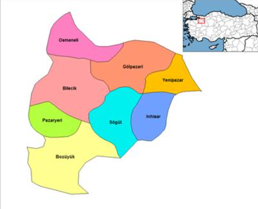
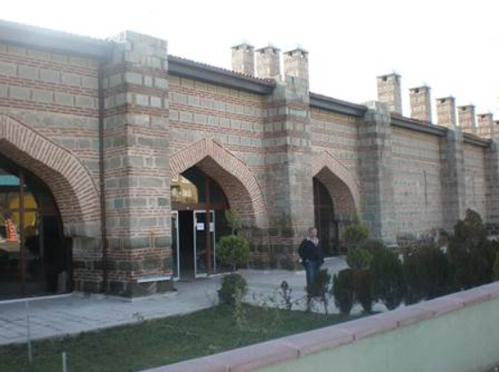
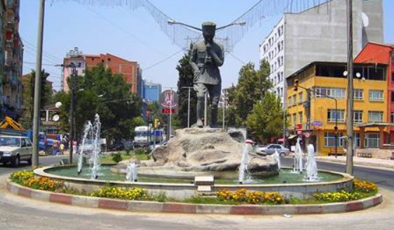
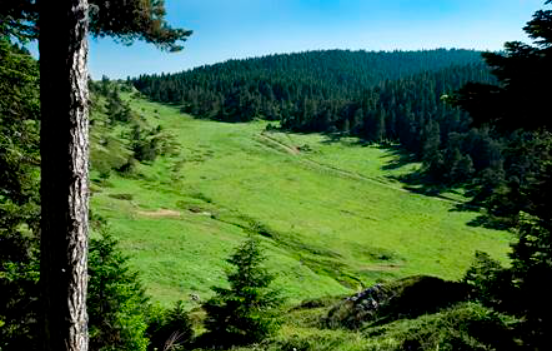
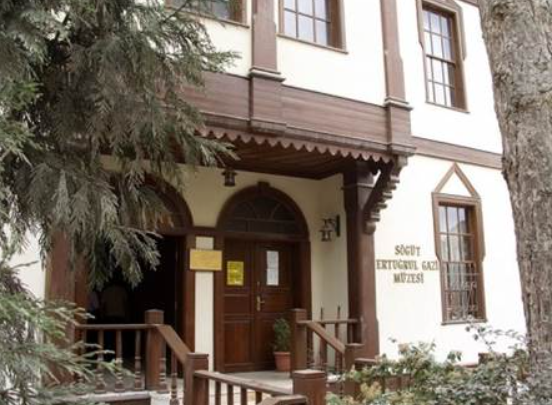
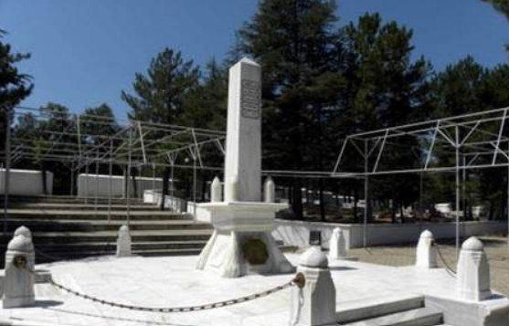
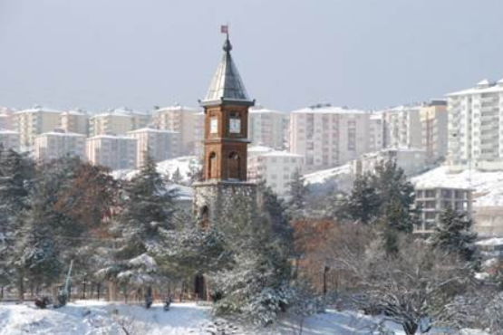

<!DOCTYPE html>
<html>
    <head>

        <title>VVVVVVV</title>  
        

    </head>

    <body>

        <header>
            <h1>Memleket Tanıtımı</h1>
         </header>

        

            

                <h1 style="font-size: 50px;">Bilecik</h1>

                <li><a style="font-size: 20px;" href="#V1">Bilecik İli</a></li>
                <li><a style="font-size: 20px;" href="#V2">Antik Çağlarda Bilecik</a></li>
                <li><a style="font-size: 20px;" href="#V3">Osmanlı Devleti Döneminde Bilecik</a></li>
                <li><a style="font-size: 20px;" href="#V4">Kurtuluş Savaşı Döneminde Bilecik</a></li>
                <li><a style="font-size: 20px;" href="#V5">Cumhuriyet Döneminde Bilecik</a></li>
                <li><a style="font-size: 20px;" href="#V6">Bilecik İlinin Adı Nereden Gelmiştir?</a></li>
                <li><a style="font-size: 20px;" href="#V7">Bilecik  Coğrafi Konumu</a></li>
                <li><a style="font-size: 20px;" href="#V8">Bilecik İklimi</a></li>
                <li><a style="font-size: 20px;" href="#V9">Bilecik İlçeleri</a></li>
                <li><a style="font-size: 20px;" href="#V10">Bilecik Edebiyatı</a></li>
                <li><a style="font-size: 20px;" href="#V11">Bilecik Yöresel Yemekler</a></li>
                <li><a style="font-size: 20px;" href="#V12">Bilecik’te Kültür Turizm</a></li>
                <li><a style="font-size: 20px;" href="#V13">Bilecik Müzeleri</a></li>
                <li><a style="font-size: 20px;" href="#V14">Bilecik Camileri, Türbeleri ve Diğer Yapıları</a></li>

                
<<h1 style="color:#000000CC ; font-size: 30px;">Bilecik İli</h1>/div>
                
Bilecik, Türkiye’nin 4 tane coğrafi bölgesinde toprakları olan tek ilimizdir. Marmara bölgesine bağlı olmasına rağmen Ege Bölgesi, İç Anadolu Bölgesi ve Karadeniz Bölgesinde de toprakları vardır. Bilecik, Sakarya ırmağının etrafına kurulmuştur. Göletleri ve derelerinin çokluğu ile bereketli toprakları vardır. Bilecik merkez hariç 7 tane ilçesi, 7 tane beldesi ve 243 tane köyü bulunmaktadır.

                
<h1 style="color:#000000CC ; font-size: 30px;">Antik Çağlarda Bilecik</h1>

                
Siyasi ve kültürel gelişimi, Anadolu’nun geneliyle paralellik gösteren il, M.Ö.2.binde Hitit, ardından da İ.Ö.1200’de Frig egemenlik bölgeleri içerisinde kalmıştır. Bu süreçte Bilecik, hem maden ticareti dolayısıyla hem de Trakya ve Anadolu arasında bir geçiş noktası olması nedeniyle, hızlı gelişen bir yerleşim merkezi olmuştur. Frigler zamanında bölgeye hayat veren Sakarya ırmağının adıSangarios (ulu ırmak tanrısı) olarak bilinmektedir. Bilecik’in yer aldığı bölge Phrygia Epiktetos, Trakyalı Bithynia’lılar ülkesi olarak adlandırılmıştır.

                

                
<h1 style="color:#000000CC ; font-size: 30px;">Osmanlı Devleti Döneminde Bilecik</h1>

                
1071 Malazgirt Savaşından sonra Anadolu fatihi ve Anadolu Türk devletinin kurucusu Selçuklu Kutalmışoğlu Birinci Süleyman Şah’ın ordularınca Bilecik fethedilmiş; Birinci Haçlı Seferinde ise Bilecik yeniden Bizans tarafından alınmıştır. Selçukluların bir boyu olan Kayıların bir bölümü (400 çadırlık bir oba) Ertuğrul Gazi yönetiminde batıya doğru yer değiştirerek Söğüt ilçesi ve çevresine gelmişlerdir. Bilecik, Yıldırım Bayezid dönemine kadar Osmanlı yönetiminde kalmış ancak 1402 yılında Ankara meydan savaşında Bayezid’in Timur’a yenilmesi sonucunda 2 ay kadar Timur’un hâkimiyetine geçmiş ve Çelebi Sultan Mehmet tarafından geri alınmıştır. Bu tarihten sonra, Osmanlı yönetimi sırasında Bilecik giderek gelişmiş, ancak, şehrin kurulu bulunduğu alanın iskân için uygun olmaması daha hızlı gelişmesini engellemiştir.

                

                
<h1 style="color:#000000CC ; font-size: 30px;">Kurtuluş Savaşı Döneminde Bilecik</h1>

                
Ana hatları 24 Nisan 1920′de San Remo Konferansı’nda kararlaştırılan Sevr Antlaşması, 11 Mayıs 1920′de incelenmek üzere Osmanlı Hükümeti’ne verilmişti. Antlaşmanın kabulünü kolaylaştırmak ve Sevr hükümlerini uygulamak üzere, İtilaf Devletleri’nin teşvik ve desteği ile Yunan ordusu 23 Haziran 1920′de Anadolu’da ve Trakya’da saldırıya geçti. Bursa’nın, Balıkesir’in, Uşak’ın ve Nazilli’nin ardı ardına işgali ile Sevr’in uygulanmasını sağlamak ve antlaşma maddelerinde herhangi bir değişikliğe meydan vermemek bu saldırıda esas amaç olmuştu.

                
<h1 style="color:#000000CC ; font-size: 30px;">Cumhuriyet Döneminde Bilecik</h1>

                
Kurtuluş Savaşından çok büyük yaralar alarak çıkmış olan Bilecik, savaşın getirdiği sosyal ve ekonomik çöküntü nedeniyle Cumhuriyet dönemine çok güçsüz başlamıştır. Bilecik halkı Kurtuluş Savaşına tüm varlığı ile katılmış, gerek milis kuvvetleri ve gerekse düzenli ordularımıza on binlerce evladını vermiştir. Bilecik, Kurtuluş savaşından yanmış, yıkılmış; tam bir enkaz halinde çıkmıştır. 1920’lerde 12.000 olduğu tahmin edilen şehir nüfusu, savaştan sonra 4.000’e kadar inmiştir.

                
<h1 style="color:#000000CC ; font-size: 30px;">Bilecik İlinin Adı Nereden Gelmiştir?</h1>

                
İlin bilinen eski isimleri arasında Agrilion ve Belekome’yi görmekteyiz. Prof. Dr. Bilge UMAR “Bithynia” adlı kitabında Agrileion / Belo Kome / Bilecik adı hakkında şu açıklamayı yapmaktadır: “Agrilion/Agrileion adının öz biçiminin Akr(a)-ilion olduğunu kesin güvenle görebiliyoruz. Bu, ‘dorukların boğaz yeri’ anlamını belirtir. Bilecik kentinin atası olan yerleşimin son Bizans çağındaki adının Belo Kome olduğunu bilmekteyiz. Yani o kome (köyün) lokalizasyonu konusunda bir duraksama yoktur; köy, tarihçi Pakhymeres’in yapıtında anılmaktadır. Fakat Belo adının o dilde bir anlamı yoktur. Ramsay’e göre (s.227 No.17) Belo Kome adı, Türkçe Bilecik adının Rum ağzına uydurulmuş biçimidir. Oysa Bilecik sözcüğünün sondaki –cik takısı dışında Türkçeyle bir ilgisi yoktur. Türkçede anlamı yoktur. Bele Kome adı (Vilo Komi okunur), bazı bilgi kaynaklarımızda, örneğin (Devlet yayını) Türk Ansiklopedisi’nin Bilecik maddesinde, Bele Kome diye aktarılıyor. Bele (Vile) adının Türk ağzından önce Vile-cik, sonra Bilecik olması doğaldır. Bu ad, Thrak kökenli Bithyn dilinden ya da (yine Thrak kökenli) Phyrg dilinden gelmiş olmalıdır. Gerçekten, Bizans İmparatorluğu’nun Thrake (Trakya) ilinde, Iustinianus döneminde (527–565) kurulan bir kale, Beledina adını taşıyordu.”

                
<h1 style="color:#000000CC ; font-size: 30px;">Bilecik  Coğrafi Konumu</h1>

                
Bilecik, Marmara Bölgesi’nin güneydoğusunda, Marmara, Karadeniz, İç Anadolu ve Ege Bölgelerinin kesim noktaları üzerindedir. 39° ve 40° 31’ kuzey enlemleri ile 29° 43’ ve 30° 41’ doğu boylamları arasında bulunmaktadır. Doğudan Bolu ve Eskişehir, güneyden Kütahya, batıdan Bursa, kuzeyden Sakarya illeri ile çevrilidir.
                      
                    <b>Bilecik Yüzölçümü</b>   
                    Yüzölçümü 4.307 kilometre karedir. Bilecik 4302 km²’lik alanı ile Türkiye’nin küçük illerinden biridir. Alan sıralaması bakımından 65. sırada yer almaktadır.  
                    <b>Bilecik Nüfus</b>   
                    2012 yılında yapılan nüfus sayımına göre Bilecik ilinin nüfusu 204.116′dır. Bu nüfusun %76′sı il ve ilçe merkezlerinde, %24′ü kırsal alanlarda yaşamaktadır.

                

                
<h1 style="color:#000000CC ; font-size: 30px;">Bilecik İklimi</h1>

                
Bilecik ilinin geçit bölgesinde bulunması, su kaynakları ve farklılık gösteren topografyasına paralel olarak 3 farklı iklim tipi görülür. Genel olarak Merkez, Gölpazarı, Osmaneli ve Söğüt İlçelerinde Marmara Bölgesi; Bozüyük, Pazaryeri ve Yenipazar ilçelerinde ise İç Anadolu Bölgesi iklimleri geçerlidir. Ayrıca Gölpazarı, Osmaneli ve Söğüt ilçelerinin Sakarya Irmağı kıyı şeridinde mikro-klima iklim bölgeleri görülmektedir. Bilecik İlinde yıllık yağış toplamı 450 kg/m² dolayındadır. Yağış en çok ocak ve mayıs aylarında düşmektedir. Bulutluluk durumu açısından 92 gün açık, 96 gün kapalı ve 177 gün bulutlu geçmektedir.

                
<h1 style="color:#000000CC ; font-size: 30px;">Bilecik İlçeleri</h1>

                
<b>Bozüyük</b>  Bozüyük Frigler döneminde oluşmuş bir yerleşim merkezidir. 1908’den sonra Ertuğrul Livası’na bağlanarak Kaza merkezi yapılmıştır. Bozüyük Bilecik’in il olması ile birlikte 1924 yılında ilçe statüsüne kavuşturulmuştur.  
                <b>Gölpazarı</b>  Bizanslılar döneminde Harmankaya Tekfurluğu’na bağlı olan Gölpazarı, Osman Gazi tarafından alınmıştır. Gölpazarı kuruluşundan itibaren sıra ile Resulşel, Dönen ve Akçaova (Akçaoba) adlarıyla anılmış, son olarak Gölpazarı adını almıştır.  
                <b>İnhisar</b>  İnhisar önceleri Söğüt’e bağlı bir bucak iken mütevazı nüfusuna rağmen coğrafi konumu dikkate alınarak 1991 yılında ilçe yapılmıştır.  
                <b>Osmaneli</b>  Osmaneli çok eski bir yerleşim yeridir; Trakyalılar, Romalılar ve Bizans’a ait kalıntılar bunu göstermektedir.  
                <b>Pazaryeri</b>  Pazaryeri’nde ilk yerleşim 1273 yılında olmuştur. Pazaryeri’nde hediyelik ve turistik toprak ev eşyası ve ağaç eşya yapımcılığı da sürdürülmektedir. Pazaryeri İlçesi Kınık Köyünün Toprak Ürünleri ile Dereköy’de yapılan el sanatı ürünü ağızlıklar, alınabilecek hediyelik eşyalardır. İnhisar İlçesi ve Tarpak Beldesi Marmara Bölgesi nar üretiminde 1. sıradadır.  
                <b>Söğüt</b>  Söğüt, Ertuğrul Gazi tarafından bir kuşatma ve mücadele sonucunda 1232 yılında Bizanslılardan alınmıştır. Ertuğrul Gazi Türbesinin de içinde bulunduğu ilçe önemli bir turizm merkezidir.  
                <b>Yenipazar</b>  Eski adı Kırka olan Yenipazar, Cumhuriyetten önce Bolu’nun Göynük ilçesine bağlıydı. 1926’da bucak olarak Gölpazarı’na bağlanmış, 1988’de de ilçe olmuştur.

                
<h1 style="color:#000000CC ; font-size: 30px;">Bilecik Edebiyatı</h1>

                
<b>Şeyh Edebalı</b>  Edebalı, 1208 yılında Horasan’ın Merv şehrinde doğmuştur. Osman Gazi’nin kayınpederi ve Anadolu’nun ilk Ahi Şeyhlerindendir. çocukluğunu Horasan’da geçiren Edebalı, tahsilini Şam’da tamamlayarak devrin büyük bilginlerinden ders almış ve Eskişehir’in İtburnu Köyüne yerleşmiştir. Ertuğrul Gazi ve Osman Gazi, kuruluş döneminde ahilerden ve özellikle Ahi Şeyhi olan Edebalı’dan büyük yardım görmüşlerdir.Osman Bey, Söğüt’teki tanışmasından sonra (1281) sık sık Şeyh Edebalı’nın Eskişehir’deki dergahını ziyaret ederek onun görüşlerinden faydalanmıştır. Edebalı Bilecik’in fethinden sonra da Bilecik Kadılığına tayin edilmiştir.  
                <b>Dursun Fakıh</b>  Karaman’da doğmuş, Şeyh Edebalı’nın öğrencisidir. Dursun Fakıh; tefsir, hadis, fıkıh bilimlerini okumuştur. Osmanlı Devletinin kuruluşuna şahitlik etmiş bir Türk Bilginidir . Şeyh Edebalı’nın kızını alarak damadı ve Osman Gazi ile de bacanak olmuştur. 28 Eylül 1299 yılında Karacahisar fethedildikten sonra, Osman Gazi adına Cuma Hutbesini okuyup, Cuma Namazını kıldırmıştır. Böylece, hem Osman Gazi’nin hür ve tam İstiklal sahibi bir Devlet Başkanı olduğunu, hem de Osmanlı Devletinin İstiklalini dünyaya ilan etmiştir. Dursun Fakıh, Osmanlı Devletinin ilk imam-hatibi ve ilk kadısıdır. “Gazavetname” adlı bir eseri bulunmaktadır. Anadolu’da milli birlik ve milli kültür birliğinin oluşmasına hizmet eden bir Türk Büyüğüdür.1327 yılında vefat etmiştir.

                
<h1 style="color:#000000CC ; font-size: 30px;">Bilecik Yöresel Yemekler</h1>

                
Beslenmede, tahıl türleri ilk sırayı alır. İl’e özgü yemeklerin çoğunluğunu hamur işleri oluşturur. Yöre halkının bir bölümü ekmeğini kendisi pişirir. Pide, bükme, hodalak fırında pişirilen ekmek türleridir. Ayrıca yeni sönmüş ocağın kıvılcımlı küllü ateşine gömülerek yapılan kömme diye adlandırılan bir tür ekmek de yapılmaktadır.Yöre halkı makarna,tarhana,kuskus,erişte gibi yiyecekleri de kendisi hazırlar. Bilecik’te,kentsel beslenme biçimleri giderek etki  alanını genişletmektedir. Ancak,geleneksel beslenme düzeni ve özgün yemekler,ağırlığını korumaktadır. Büzme,nohutlu tavuklu mantı,keşkek,ovmaç çorbası, mercimekli mantı,kesme hamur,saçta yufka böreği, yağlı yufka, su böreği,keklik kebabı güveç, kuru fasülye, kuskus pilavı, piruhi, samsı, pancar pekmezi, saç kebabı, köpük helvası, hoşmerim, kıtırcı helvası, karacaoğlu helvası, cevizli üzüm sucuğu, mantı, kavurma Bilecik’e özgü yemeklerin başlıcalarıdır.

                
<h1 style="color:#000000CC ; font-size: 30px;">Bilecik’te Kültür Turizm</h1>

                
Tarihte pek çok kavmin uygarlık ve egemenliğine sahne olan Bilecik, Kayı Boyu’nun Orta Asya’dan 400 çadırla gelip Söğüt’te, Osmanlı Devletinin kuruluş merkezliğini yapması dolayısıyla farklı bir özelliğe sahiptir. İlin kuruluş tarihçesinin çok eskilere dayanması ve Osmanlının kurulduğu yer olması ayrıcalığı yanında, Kurtuluş Savaşı’nda verdiği çetin mücadeleler ve kazanılan zaferlerle Cumhuriyetin kuruluşunda da önemli bir role sahip, tarihi-kültürel varlıklar bakımından zengin bir İlimizdir. Üzerinde çok sayıda arkeolojik ve tarihi eser bulunan, Bilecik’teki tarihi eserlerin çoğunu Osmanlı döneminde yapılan camiler, türbeler, hanlar, hamamlar, sivil mimari örnekleri, imaret ve benzeri yapılar oluşturmaktadır. Kuruluş yıllarında inşa edilen eserlerin bir kısmı günümüze kadar sağlam kalabilmiş, bir kısmı ise Kurtuluş Savaşında Yunanlılar tarafından büyük tahribata uğratılmıştır.Ayrıca, diğer medeniyetlerden kalan kaya mezar, kilise, kale kalıntıları yanında Kurtuluş Savaşının simgeleri abideler ile içinde çeşitli kültürlere ait izlerin yer aldığı Söğüt Etnografya Müzesi önemli kültürel varlıklardır. Kayı Boyu Aşireti mensuplarının 731 yıldan beri geleneksel olarak sürdürdükleri ve her yıl Eylül ayının 2. haftası Pazar günü muhteşem törenlerle kutlanan “Ertuğrul Gazi’yi Anma ve Söğüt Şenlikleri”ne (Yörük Bayramı) çok sayıda yerli ve yabancı ziyaretçi gelir. Türkiye’nin dört bir yanından gelen Kayı Boyu Yörükleri ile töre halkı mutlu, anlamlı güzel bir ortamın oluşmasını sağlayan bu törenlere ülkenin çeşitli yörelerinden gelen ve şenlikleri kendi bayramı olarak kabul eden on binlerce Yörük aşiretinin geleneksel, mahalli, rengârenk kıyafetleri, gösterileri ve ikramları ile izleyenlere Osmanlı Devletinin Kuruluş yılları yaşatılır. Şanlıurfa’dan, Gaziantep’ten, Kütahya’dan, Afyon’dan, Kırıkkale’den, Balıkesir’den, Adapazarı’ndan. Türkiye’nin dört bir yanından gelen Yörükler, yurtdışından Kazakistan’dan, Kırgızistan’dan, Azerbaycan’dan, Tataristan’dan, Özbekistan’dan gelenler kuruluş yıllarının engin mana ve coşkusunu yaşatırlar.Tören alanında çeşitli yörelerden gelen folklor ekiplerinin oyunları, paraşüt gösterileri, cirit oyunları, Yörüklerin kına gecesi ve yaşantıları canlandırılır. Törenler üç gün devam eder. Törenlere katılan konuklara şifalı pilav ikram edilir. Osmanlı’nın sağlam temeller üzerinde kurulmasında büyük emeği geçen ve Osmanlı’nın manevi mimarı sayılan Edebalı için Bilecik’te her yıl 6 eylül tarihinde çeşitli sanat, folklor ve kültürel etkinliklerin yer aldığı “Bileciğin Kurtuluşu Şenlikleri” ve Eylül ayının 2. haftası “Ahilik Haftası“ kutlanmaktadır. Gelen konuklara türbe çevresinde şenlik pilavı ve üzüm ikram edilir. Şeyh Edebalı Türbesi yanındaki Orhan Gazi Camiinde mevlit okunur, Şehir stadyumunda çeşitli spor müsabakaları yapılır.

                

                
<h1 style="color:#000000CC ; font-size: 30px;">Bilecik Müzeleri</h1>

                
Bilecik Müzesi
                    Mülkiyeti hazineye ait olan bina, 1794 yılında jandarma binası olarak iki katlı inşa edilmiştir. 1921–1922 yıllarında Bilecik’in Yunanlılar tarafından işgali sırasında yakılarak enkaz haline gelen yapı, Kurtuluş Savaşı’ndan sonra temelleri üzerine yeniden inşa edilmiş ve 1995 yılına kadar Adliye Binası ve hapishane olarak hizmet vermiştir. Binanın 1997 yılında Kültür ve Turizm Bakanlığı’na devredilmesiyle, müze olarak kullanılması amacıyla restorasyon çalışmaları başlatılmış; 2006 yılında restorasyonun tamamlanması ile 20.04.2007 tarihinde Söğüt Müze Müdürlüğü’ne bağlı bir birim olarak hizmete açılmıştır. Kültür ve Turizm Bakanlığının taşra teşkilatına bağlı olarak Bilecik İlinde Bilecik Müzesi Müdürlüğükurulması; Devlet Planlama Teşkilatı ile Devlet Personel Başkanlığının görüşlerine dayanan Kültür ve Turizm Bakanlığının 24/2/2010 tarihli ve 39770 sayılı yazısı üzerine, 27/9/1984 tarihli ve 3046 sayılı Kanunun 17 ncimaddesinin (d) bendine göre, Bakanlar Kurulu’nca 11/3/2010 tarihinde kararlaştırılmış, 7 Nisan 2010 tarih 27545 sayılı kararla Bilecik Müzesi Müdürlüğü olarak hizmete devam etmektedir.Müzede Bilecik ve çevresine ait arkeolojik ve etnoğrafik eserler sergilenmektedir.Salonlarda kronolojik sergileme tekniği uygulanmış olup 3 adet teşhir salonunda; Roma Dönemi ağırlıklı olmak üzere Paleolitik, Neolitik, Tunç, Hellenistik, Roma, Bizans ve Osmanlı Dönemleri’ne tarihlenen eserler sergilenmektedir.10 adet teşhir salonunda Osmanlı Devleti’nin kuruluşu ile ilgili tasvirler, oba ve ev yaşantısından kesitler sunulmakta; silahlar, seramik ve metalden yapılan günlük kullanım kapları, Bilecik yöresine ait giysiler, süs eşyaları sergilenmektedir. Ayrıca Bilecik ve ilçelerinde bulunan sivil mimari örnekleri de panolar şeklinde sergilenmektedir. Müzenin ön bahçesinde ve iç avlularında Roma ve Bizans Dönemleri’ne tarihlenen, çoğunlukla kalker mezar stelleri, sütun başlıkları, sütun kaideleri, pithoslar, az sayıda heykel ve iki adet vaftiz teknesi sergilenmektedir. Eserlerin çoğunluğunu Bilecik çevresinden gelenler oluşturmaktadır.
                    
                    Söğüt Ertuğrul Gazi Müzesi
                    Yapım tarihi kesin olarak bilinmemekle beraber belediye reisi Memiş Ağa tarafından 1900’lü yılların başlarında “sargı evi” olarak inşa edildiği bilinmektedir. Sargı evinin bugünkü dispanser anlamında bir fonksiyonu karşıladığı düşülmektedir. Ahşap işçiliğiyle dikkat çeken yapının ön cephesinde yan yana iki yuvarlak kemerli kapı, iki yan duvarlarda ise dikine dikdörtgen birer pencere ve üstlerinde üçgen alınlılar yer almaktadır. Ahşap kırma çatılı olup çatı alaturka kiremitle kaplıdır. Eski Türk evi mimarisiyle restore edilerek 2001 yılında hizmete açılan Müze’de Söğüt ve civarı ile yakın çevrede yaşayan Yörüklere ait etnoğrafik eserler ve eşyalar sergilenmektedir. Müzede ayrıca sancak, eski giyim ve kuşamlar, el dokuması kilim ve halılar, silahlar, ölçü ve tartı aletleri, peşkir ve para keseleri, arkeolojik eserler (Roma, Bizans, Osmanlı dönemlerine ait sikkeler, Roma dönemine ait toprak kaplar) de mevcuttur.

                    

                
<h1 style="color:#000000CC ; font-size: 30px;">Bilecik Camileri, Türbeleri ve Diğer Yapıları</h1>

                
 Orhan Gazi Camii
                    Orhan Gazi Camiinin ilk yapılış tarihi kesin olarak bilinmemekle beraber Orhan Gazinin diğer eserleriyle birlikte 14. yy. başında yapıldığı sanılmakta olup, 365 cemaat kapasiteli mabet 1973 yılında tamirattan geçirilmiş ve restore edilmiştir. Edebalı Türbesine 50 m. uzaklıkta olup, en ilginç yanı, minareler camiye bitişik olurken, burada ise asıl minaresi ana binadan 30 m. uzakta bir kayanın üzerine inşa edilmiş olmasıdır. II. Abdülhamid zamanında önemli bir onarım görmüştür. Orhan Gazi Camii Osmanlı Devri Türk mimari sanatının Dini mimari alanında ilk kubbeli yapı denemesinin örneğidir. Kubbe üzeri restorasyon sırasında kurşunla kaplandığı için Kurşunlu Camii adıyla bilinir.  
                    
                     Köprülü Mehmet Paşa Camii
                    1665 yılında Köprülü Mehmet Paşa tarafından yaptırılan cami, Bilecik-Sakarya Karayolu üzerinde Vezirhan beldesinde, Köprülü Mehmet Paşa Kervansarayı yakınındadır. Dikdörtgen planlı, duvarları kesme taştandır. Bilecik, Vezirhan’da olan bu camiyi Köprülü Mehmet Paşa 1665’de yaptırmıştır. Mimar Sinan eseri olduğu ileri sürülen caminin bu iddiayı kesinleştirecek bir belgeye rastlanmamıştır. Cami dikdörtgen planlı olup, 17.30 X 18.60 m. ölçüsünde, kesme taştan yapılmıştır.
                    
                    Üzeri kırma çatı ile örtülüdür. Kuzey kenarında birbirlerine yuvarlak kemerlerle bağlı altı sütunlu beş bölümlü bir son cemaat yeri bulunmaktadır. Son cemaat yeri ile ibadet mekanı kırma bir çatı ile örtülmüştür. İbadet mekanı sonraki devirlerde yapılmış ahşap bir tavanla örtülmüştür. İbadet mekanı yan duvarlarda ikişer, mihrap duvarında iki sıra halinde yuvarlak kemerli pencerelerle aydınlatılmıştır. Mihrabı basit olmasına rağmen rozetler, stalaktitlerle süslü minberinin sanat tarihi yönünden güzel bir görünüm vardır. Kuzeybatı köşesindeki kesme taştan minaresi 1965 yılında yenilenmiştir.  
                    
                     Hamidiye Camii
                    Söğüt İlçesinde son Osmanlı döneminin neo-klasik mimari tarzdaki yapılardan güzel bir örnektir. 1903-1905 yıllarında II. Abdülhamit tarafından yaptırılmıştır. Kare planlı olup, duvarları kırmızı kesme taştandır. Yapının üstü kurşun kaplı tek bir kubbeyle örtülüdür. İki minareli olduğu için halk arasında “Çifte Minareli Camii” olarak da tanınır.Rüstem Paşa Camii
                    Osmaneli ilçe merkezinde, klasik üslupta yapılmış olan yapı, Ulu Cami adıyla da tanınır. Mimar Sinan’ın çıraklarından biri tarafından yapıldığı tahmin edilen cami kareye yakın dikdörtgen planlı olup, kesme taştan inşa edilmiştir.  

                    

                
Çelebi Mehmet Camii
                    1414—1420 yılları arasında Sultan I. Mehmet Çelebi tarafından yaptırılmış olup, Osmanlı Mimarlık Sanatının kubbeli yapılar türündeki ilk örneklerindendir. Dikdörtgen görünümlü olan ve 12 kubbesi bulunan Camii, Sultan II. Abdülhamit tarafından onarılmış ve onarım esnasında genişletildiğinden bazı değişikliklere uğramıştır.  
                    
                     Kasım Paşa Camii
                    Bozüyük ilçe merkezindeki cami, klasik Osmanlı camilerinin tipik örneklerindendir. 1525-1528 tarihlerinde Kanuni Sultan Süleyman’ın komutanlarından Kasım Paşa tarafından Mimar Sinan’a yaptırılmıştır. Duvarları kesme taştan olan yapının tek kasnaklara oturan üç kubbeli son cemaat yeri bulunmaktadır. Giriş kapısı ve mihrabın yanındaki pencerelerin ahşap kanatları ağaç işçiliği ve fildişi kakmaları ile ilgi çekici olup minberi ak mermerden çeşitli renkte çinilerle kaplıdır. 1,75 m. yüksekliğinde dört sütunun üstüne kare bir mermer levha konarak kürsü durumuna getirilmiştir.  
                    
                     Şeyh Edebalı Türbesi
                    Şeyh Edebalı 1206 yılında Merv’de doğdu. Selçukluların Şeyh’ül İslam’ı Şeyh Sadrettin Konevi ve Mevlana Celaleddini Rumi’nin çağdaşıdır. Künyesi İmadüddin Mustafa b.İbrahim b.İnac el-Kırşehri’dir. Edebalı ilk tahsilini Karaman’da yaptı. Hanefi hukukçusu Necmeddin ez-Zahidi’nin öğrencisi oldu. Daha sonra Dımaşk’a (Şam) giderek Sadreddin Süleyman b.Ebül-iz ve Cemalettin el-Hasiri gibi dönemin tanınmış alimlerinden dini ilim tahsil etti. Şam’dan ülkesine dönünce tasavvufa yöneldi. Eskişehir yakınlarında bulunan İtburnu Köyü’nde bir zaviye kurarak halkı irşada başladı. Aşıkpaşazade zaviyesinin hiç boş kalmadığını, Edebalı’nın gelip geçen fukaranın hertürlü ihtiyacını gidermeye çalıştığını, hatta bu maksatla koyun sürüsü bulundurduğunu kaydederler. Söğüt ve Domaniç yaylaları, Selçuklu Devleti tarafından aşiretine yaylak ve kışlak olarak verilen Osman Gazi sık sık Edebalı’nın zaviyesinde misafir olarak kalırdı. Orta Asya’dan getirdikleri bir takım özelliklerden dolayı alim ve sufilere karşı son derece hürmeti olan Osman Gazi, mübarek günlerde Edebalı’nın zaviyesine giderek dini ve idari konularda , onun görüşlerini alırdı.  
                    
                     Ertuğrul Gazi Türbesi
                    Ertuğrul Gazi Türbesi, Osmanlı Beyliği’nin kurucusu Osman Gazi’nin babası ve Selçuklu Uçbeyi Ertuğrul Gazi’nin Bilecik ilinin Söğüt ilçesinde bulunan türbesidir. 13. yüzyıl sonlarında inşa edilen yapının yapım tarihi kesin olarak bilinmemektedir. İlk olarak Osman Gazi tarafından açık mezar olarak yaptırılmış, daha sonra I. Mehmet Çelebi tarafından türbe haline getirilmiştir. Sultan III. Mustafa zamanında 1757’de yeniden yapılırcasına onarılmış ve ilk yapılıştaki hali değişmiştir. 1886 yılında II. Abdülhamit tarafından yeniden onartılmış ve yanına çeşme eklenmiştir. Ertuğrul Gazi Türbesi altıgen planlı, üzeri kubbe örtülü olup, dikdörtgen bir girişten sonra içeriye ulaşılmaktadır. Bu girişin yanlarında ikişer pencere bulunmaktadır. Türbenin duvarları bir sıra taş ve iki sıra tuğladan örülmüştür. Sandukanın bulunduğu türbenin içindeki batı ve güneydoğu duvarlarına dikdörtgen pencereler açılmıştır.  
                    
                     Köprülü Mehmet Paşa Kervansarayı
                    Kervansarayın yapım tarihini gösteren kitabesi olmamakla beraber XVII. yüzyılda (muhtemelen l655 yılında) Kanuni Sultan Süleyman’ın veziri olan Rüstem Paşa tarafından yaptırıldığı bilinmektedir. Köprülü Mehmet Paşa’nın vakıf eseri olarak tapuda kaydı bulunmaktadır. 3008 metrekarelik bir alan üzerinde bulunan kervansaray, 101.52×27.21 m. ölçülerinde dikdörtgen planlı olup taş ve tuğla malzemeden harç ile inşa edilmiştir. Simetrik planlıdır. Üç bölümlü kervansarayın orta kısmı iki yandakilere göre biraz daha farklıdır. Bu bölüm girişe ayrılmış, yapımında taş ve tuğla kullanılmıştır. İç kısmında her iki yanda duvarlara ocaklar yerleştirilmiştir. Yanlara sekiler yapılmış ve bunlar zeminden daha yüksek tutulmuştur. Bu durumda ortada araba ve atlar, iki yanda da yolcuların konaklaması sağlanmıştır.Duvarlardaki ocakların üzerine de küçük, mazgal niteliğinde pencereler açılmıştır. Dışa kapalı, payandalarla desteklenen, kale görünümündeki kervansarayın üzeri iki yana meyilli ahşap kırma bir çatı ile örtülmüştür. İçerideki ahşap sütun dizisi ve kirişler çatıyı taşımaktadır. Bu çatı 1912 yılına kadar sağlam durumda kalmış, bundan sonra yıkılmış ve kervansaray kendi haline terkedilmiştir. Vakıflar Genel Müdürlüğünün, atıl ve yıkıntı durumundaki vakıf eserlerini ayağa kaldırılmak için başlattığı restorasyon çalışmaları kapsamında projesi hazırlanan ve 2007 yılında 4,5 milyon TL’lik bir ödenekle restorasyonuna başlanan tarihi kervansarayın restorasyonu 3 yılda tamamlanmıştır. Kuruluş amacına uygun şekilde 36 odalı butik otele dönüştürülmesi planlanan Kervansaray, 400 yıl sonra yeni misafirlerini ağırlamaya hazırlanıyor.  

                     Kaymakam Çeşmesi
                    Söğüt ilçe merkezinde bulunan, 1919 yılında Kaymakam Sait Bey tarafından yaptırılmış Neo-Klasik üsluptaki çeşme, Osmanlı mimarlık sanatı son döneminin önemli bir örneğidir. Çeşmenin üç kenarının ortalarında dilimli vazo biçiminde yalakları, yalakların iki yanında kabartma yaldız motifleri bulunmaktadır. Yüzeyler ve sivri kemerler niş biçiminde olup, nişin içi ve üstü renkli çinilerle kaplıdır. Çeşme dört cephelidir ve Kütahya çinileri ve mermerden yapılmıştır.  
                    
                     Kilise
                    Osmaneli ilçe merkezindeki yapı, doğu ve batı sanatının işlendiği üç nefli, haç planlı kubbeli bazilika tarzında bir yapıdır. Ortadaki küçük kubbesi ve çatı örtüsü yıkılmıştır. Kubbe dışında kalan çatı örtüsünün tonozla örtülü olduğu anlaşılmaktadır. Ön cephenin iki köşesinde birer çan kulesi yükselmektedir. Bina, Ortaçağ kiliselerinin XIX. y.y. sonlarına doğru yapılmış bir taklididir.  
                    
                     Metristepe Zafer Anıtı
                    Yakın tarihimizde çok önemli yeri olan ve Türk İstiklal Savaşımızın en çetin mücadelelerinin geçtiği, dönüm noktalarından biri olan İnönü Savaşları’nın kazanıldığı ve Büyük Önder Atatürk’ün ifadesiyle “milletin makûs talihinin yenildiği yer” olan Bozüyük Metristepe’de şehitlerimizin yüce anılarını yaşatmak amacıyla yapılan Metristepe Anıtı, o muhteşem görünüşüyle Türk’ün yenilmezliğini simgelemektedir. Betonarme olarak 24 metre yüksekliğinde yapılan anıt üzerinde rölyefler, savaşa katılan birlikler ve komutanlarıyla ilgili bilgiler bulunur. Metristepe’nin tarihsel önemi dikkate alınarak Valilikçe 2001 yılında anıt ve çevresinde yeniden restorasyon çalışmaları yapılmıştır. Anıtın dört bir tarafına ve anıttan ayrı İnönü Savaşları ve tarihi telgrafları içeren dört adet rölyef ile anıtın ön tarafına iki ayrı kaide üzerinde heykeller yapılmış, çevresinde siperler kazılmıştır.  
                    
                     İnönü Şehitliği
                    Bozüyük’e 6 km. uzaklıktaki etrafı çam ve köknar ağaçlarıyla çevrili şehitliğin içinde çok sayıda şehit mezarı ve ayrıca mermerden yapılmış şehitlik nişan taşı bulunmaktadır. Her yıl l Nisan’da “İnönü Şehitlerini Anma Günü” burada yapılır.  

                    

                
Saat Kulesi
                    Bilecik Merkezinde İpek yolu üzerinde seyahat edenlere zamanı bildirmek amacıyla dört cepheli, saat göstergeli olarak, 1907 yılında II. Abdülhamit zamanında yapılan saat kulesi, ana bölüm olarak taş ve ağaç gövdeyle, külah kısmından ibarettir.Dursun Fakıh Türbesi
                    Osmanlı Devleti’nin kuruluşuna şahitlik etmiş bir Türk bilgini olan Dursun Fakıh, Karaman’da doğmuş, Şeyh Edebalı’nın öğrencisidir. Tefsir, hadis ve fıkıh bilimlerini okumuştur. Şeyh Edebalı’nın kızını alarak damadı ve Osman Gazi ile de bacanak olmuştur. Eylül 1299 yılında Karacahisar fethedildikten sonra Osman Gazi adına Cuma Hutbesini okuyup, Cuma namazını kıldırmıştır. Böylece, hem Osman Gazi’nin hür ve tam istiklal sahibi bir devlet başkanı olduğunu, hem de Osmanlı Devleti’nin istiklalini dünyaya ilan etmiştir. Bu vesileyle Dursun Fakıh, Osmanlı Devleti’nin ilk imam-hatibi ve ilk kadısı olma şerefini de elde etmiştir. Anadolu’da milli birlik ve milli kültür birliğinin oluşmasına hizmet eden Türk büyüğü 1327 yılında vefat etmiştir. Türbesi, ilçeye bağlı Küre beldesinde, Söğüt-Bilecik kara yolu yakınında ihtişamlı bir tepe üzerindedir.  

                    

                
Ertuğrul Gazi Mescidi (Kuyulu Mescid)
                    Söğüt Çayı kenarında bulunan mescit, Ertuğrul Gazi’nin aşiretiyle geldiğinde ilk çadır kurduğu yer olarak rivayet edilir. İçinde kuyu bulunan ve “Kuyulu Mescit” olarak da adlandırılan yapı, 1276 tarihinden önce Ertuğrul Gazi tarafından yaptırılmış, II. Abdülhamit tarafından 1902 yılında aynı temeller üzerine inşa edilmiş ve daha sonraları onarım görmüştür.  
                    
                     Atatürk Köşkü
                    Bozüyük ilçesine 22 km. uzaklıkta, Gülalan Mevkiindeki orman dokusu içerisinde güzel bir sivil mimari örneği sergileyen köşkün ve çevresinin güzellikleri hayranlık uyandırır.  
                    
                     Rüştiye Mektebi
                    Tarihi yapı ilk olarak II. Abdülhamit Dönemi’nde, 1905 yılında (Hicri 1321) Rüşdiye (ortaokul) olarak inşa edilmiş; Cumhuriyet’in kurulduğu ilk yıllara kadar da Rüşdiye olarak hizmet vermiştir. Daha sonra, Bilecik Ortaokulu olarak hizmete başlamış ve 1956–1957 eğitim öğretim yılında olarak öğretim hayatına devam etmiştir.1972 yılındaErtuğrul Gazi Lisesiyeni binasına taşınınca tarihi bina da Bilecik Öğretmen Okulu, daha sonra 1985 yılına kadar ise Bilecik Meslek Yüksek Okulu olarak kullanılmıştır.Bu tarihten itibaren yapı Anadolu Lisesi olarak varlığını sürdürmüş ve 2001 yılında tamamen boşaltılmıştır. Sonrasında, Milli Emlak Genel Müdürlüğü’ne ait olan yapı, imzalanan bir protokol ile Bilecik Belediye Başkanlığı’na tahsis edilmiştir. Protokolü izleyen süreçte ise 1 Temmuz 2005 tarihinde yeniden yapılandırma çalışmalarına başlanmış ve onarım çalışmaları 11 Eylül 2005 tarihinde tamamlanarak Bilecik Belediye Sarayı olarak hizmete açılmıştır.  
                    
                     Dar’ül Eytam
                    Hamidiye İdadisi’ne ek olarak yaptırılan; idadi ile mimari benzerliğinden dolayı 1905 yılında veya civarında yapıldığı düşünülen iki katlı kargir yapının merdiven, döşeme, tavan gibi mimari öğeleri ahşap olup iç duvarları bağdadidir. Basık kemerli pencerelerle aydınlanır. Ana cephenin ortasında beş basamakla çıkılan ve tümüyle dekoratif olan iki mermer sütunlu bir portik bulunur. Portikin üstünde Neo-Klasik devrin firuze, siyah, lacivert renkleriyle desenlendirilmiş çinili kaplamalar görülür. Saçak altlarında taşıyıcı olmaktan çok dekoratif mahiyette konsollar yer almaktadır. 2009 yılında restorasyonunun tamamlanmasının ardından Dar’ül Eytam Binası şu anda Bilecik Şeyh Edebalı Üniversitesine tahsis edilmiştir.  
                    
                     Merdiven Kaya
                    Vezirhan beldesinde bulunan Merdivenli Kaya, Roma Dönemi M.S. II. ve III. yüzyıllara ait, beyaz kalker üzerine 15 basamak halinde anakaya yüzeyi yontularak yapılmıştır. Basamaklardan bir platforma ulaşıldığı belirgindir. Bir kısmı kırılmış ve tahrip olmuştur. 2009 yılında 1.Derece Arkeolojik Sit olarak tescil edilmiştir.  
                    
                     Karacalar Camii
                    Günümüze yalnızca minaresi gelebilmiş olan bu caminin yapım tarihi tam olarak bilinmemektedir. Çalışmalarda ortaya çıkartılan temel kalıntılarından anlaşıldığı üzere cami, kare forma sahip olup moloz taş, ahşap hatıllı ve çamur sıva ile örülmüştür. Minare, düzgün kesme taş, kare kaideli olup pabuç kısmı taş ve tuğla malzeme ile yapılmıştır. Silindirik gövdesi altta ve üstte bilezikli olup tuğladan örülmüştür. Tek şerefeli, külah kısmı mevcut değildir. Minare yakın dönemde restorasyon görmüştür. Minarenin doğu yönünde ve camiye 2 metre mesafede bir adet çeşme ortaya çıkartılmıştır. Kazı çalışmaları sırasında ortaya çıkan yanık taşlar, farklı yerlerde kullanılan ahşap hatıllardaki yanık izleri bu camiinin İstiklal savaşı sırasında bölgeyi işgal eden Yunanlılar tarafından yakılıp harap edildiğinin kanıtlarıdır. Çalışmalar sırasında kazı alanında bulunan mermi kovanları bölgede savaş olduğunu desteklemektedir.
    
                <footer>

Hazırlayan : Ahmet Vurucu
</footer>

            

        

        
        
    </body>
                

</html>  
